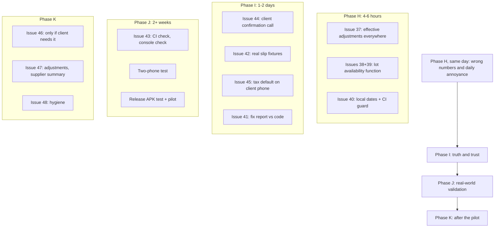

# Factory Ledger: Issues & Fixes, Part 4 (Post-Features Review)

> **Application:** Factory Ledger (`com.factoryledger.app`)
> **Commit reviewed:** `7328618` ("feat: add inventory management with landed cost, dynamic pro-rata GCV, and manual tax default"), dated 9 October 2026
> **Review date:** 9 October 2026
> **Review type:** AI-assisted code review. Typecheck, lint, unit tests and build were **executed**; five probe tests were run against the real code; the rest was **read**. Nothing was run on a physical phone, against real Firebase, or in the Firestore emulator. I could not check the GitHub Actions results (the GitHub API rate-limited my sandbox).
> **Continues:** Part 1 (Issues 1-19), Part 2 (20-30), Part 3 (31-36). Numbering here starts at **Issue 37**.

**How to use this document:** work through [Section 6, the Master Checklist](#6-master-checklist). Every issue has *Where*, *What I found*, *Why it matters*, *How to reproduce*, *Fix*, *Tests to add* and *Done when*. Log anything new in [Section 10](#10-found-while-fixing-log).

**Evidence legend**

| Tag | Meaning |
| :--- | :--- |
| **[Tested]** | Reproduced by running the real code in a test or probe |
| **[Code]** | Found by reading the code; not executed |
| **[Config]** | Found in a configuration or build file |
| **[Open]** | Not verified; needs your decision, the client's answer, or a manual check |

> Line numbers are approximate and refer to commit `7328618`. Search for the function names to find the exact spot.

---

## 1. Where Things Stand

### 1.1 What I verified is fixed (Part 3 follow-up)

| Part 3 issue | Result | How I checked |
| :--- | :--- | :--- |
| 31 Mark-clean race | **Fixed.** `markRecordsClean` takes `{ id, updatedAt }` pairs for all **five** collections; no bare-ID caller remains | Read the code; `grep markRecordsClean(` [Code] |
| 32 Pull cursor | **Fixed.** `fl_last_pulled_at` / `lastPulledAt` no longer exist; the last-sync time is saved only after local writes succeed | `grep` returns nothing [Code] |
| 33 Cleared fields | **Fixed.** Entity documents are written without `merge`; only `meta/sync` opts in | Read `commitResilient` [Code] |
| 34 Success hides rejections | **Fixed.** `unresolvedCount` flows from `syncLedgerToCloud` into `SyncManager` state | Read the code [Code] |
| 35 Clock skew | **Documented** in the README | Read README [Code] |
| 36a Deleted rows counted | **Fixed.** `calculatePartyBalance` filters deleted rows before counting | Read the code [Code] |

### 1.2 Pipeline

| Check | Result |
| :--- | :--- |
| Fresh `git clone`, `npm ci` | OK |
| `tsc -b` | 0 errors |
| `oxlint` | 0 errors, **22 warnings** (was 14) |
| `vitest run` (rules tests excluded) | 8 files, **87/87 passed**. With the 11 emulator rules tests this is the report's "98" (I could not run those) |
| `vite build` | OK; entry chunk 162.04 kB (44.66 kB gzip) |
| `npm audit --omit=dev` | 9 issues (4 moderate, 5 high), unchanged |
| Probe: Dexie v1 to v2 upgrade | Existing parties, dispatches and POs **survive**; `lots` table exists [Tested] |

### 1.3 Review of the new features: did they match the design?

You followed the design closely. The core architecture is right. The misses are in the edges (display layer, stock check on edit, date helper, a report claim).

| Design point I recommended | Done? | Notes |
| :--- | :--- | :--- |
| Default tax method = Manual | **Yes, for new installs only** | Existing stored settings win (`{...INITIAL_SETTINGS, ...parsed}`). See Issue 45 |
| Pro-rata rule at purchase-order level, copied to the dispatch | **Yes** | New dispatches inherit it from the PO |
| Pro-rata computed at settlement time, not copied as a fixed number | **Yes** | Edit the lab GCV and the price updates [Tested] |
| Old dispatches unchanged | **Yes** | A legacy manual dispatch still gives 30,387 [Tested] |
| Rounding choice (rupee or paisa) | **Yes** | Both match the client's numbers exactly [Tested]. Defaults disagree (form: rupee, calculation: paisa). See Issue 44 |
| Show the deduction / premium everywhere | **No** | Receipts, exports and shared text read raw fields. **Issue 37** |
| Derive stock from dispatches, never store it | **Yes** | `calculateLotStock`, exactly as asked |
| `lotId` on each coal row; copy the landed rate into the row | **Yes** | The frozen `purchaseRate` protects past profit |
| "Not in stock" fallback | **Yes** | "Switch to Manual" button |
| Landed cost = billed weight x rate / received weight | **Yes** | 21,052.63 for the 30 t / 28.5 t example [Tested] |
| Optional GCV / grade on a lot | **Yes** | Fields exist (not used in blend maths) |
| Warn on overdraw, allow negative stock | **Partly** | The rule is right but the check is wrong on edit and across rows. **Issues 38, 39** |
| Inventory screen: per-supplier tons, average landed cost, capital | **Partly** | Totals, filters and cards exist; **no per-supplier summary**, though the report says there is. **Issue 41** |
| Lots in upload, pull, wipe, backup, restore, rules | **Yes** | Checked in `firebase.ts`, `db.ts`, `firestore.rules` |
| Dexie schema upgrade without data loss | **Yes** | Tested |
| Stock adjustments (shrinkage, count correction) | **No** | I called this v1.1; see Issue 47 |
| Freight mine-to-yard in landed cost | **No (by your decision)** | Needs the client's confirmation. Issue 44 |
| Client answers to my 5 questions | **No** | The report's "answers" are your decisions, not his. Issue 44 |

### 1.4 Readiness by use case

| Use case | Verdict | Gate |
| :--- | :--- | :--- |
| One phone, local data, weekly JSON backups | **Pilot-ready after Issues 37, 38, 39, 40** | [Gate A](#92-gate-a-single-phone-pilot) |
| One phone with cloud as a backup | **Same fixes** | Gate A |
| Several phones syncing | **Not proven.** Needs the real two-phone test and verified CI/emulator results | [Gate B](#93-gate-b-several-phones) |
| Selling it | **No** | [Gate C](#94-gate-c-selling-it) |

---

## 2. Issues at a Glance

| # | Title | Severity | Evidence | Effort |
| :-- | :--- | :--- | :--- | :--- |
| **37** | Pro-rata deduction/premium missing from receipts, exports and shared text | **High** (wrong paperwork) | [Tested] | 2-3 h |
| **38** | Editing a dispatch shows a false "overdrawn" warning | **High** (daily annoyance, wrong figure) | [Tested] | 1-2 h |
| **39** | Overdraw is checked per row, not per lot | Medium | [Tested] | (with 38) |
| **40** | UTC dates are back (4 places in `Inventory.tsx`) | Medium | [Code] | 30 min |
| **41** | Report claims that the code does not back up (supplier summary, snippets) | Medium (trust) | [Code] | 1-2 h |
| **42** | The "10 real slips" fixture is not real slips | **High** (false confidence) | [Tested] | 0.5 day + your slips |
| **43** | Real-world validation not done; CI and rules tests unverified | **High** (gate) | [Open] | 2+ weeks |
| **44** | Client confirmations missing (freight, penalties, premium, rounding, negative stock, lot vs pool) | Medium | [Open] | 1 call |
| **45** | Manual-tax default does not reach existing installs | Low-Medium | [Code] | 30 min |
| **46** | Pro-rata replaces manual deductions (conditional on the client's answer) | Medium | [Code] | 2-3 h |
| **47** | Inventory follow-ups (adjustments, supplier summary, reprice, stale stock) | Low-Medium | [Open] | per item |
| **48** | Repo hygiene and small cleanups | Low | mixed | 2-3 h |
| **49** | Inventory-only cloud data misclassified; recovery key bypassed lockout | High | [Code] / [Tested] | 1-2 h |
| **50** | Partial stock-lot allocation, landed-cost valuation, and inventory iOS workflow | **High** (stock and profit integrity) | [Tested] | Resolved |
| **51** | Bottom navigation looked like a frosted slab rather than iOS liquid glass | Medium (global UI quality) | [Browser tested] | Resolved |

---

## 3. Issues in Detail

### Issue 37: Pro-Rata Deduction and Premium Are Missing From Receipts, Exports and Shared Text

- **Severity:** High (the printed or shared paperwork does not explain the price) | **Evidence:** [Tested] for the maths, [Code] for each display site
- **Affects:** every dispatch that uses the new "Auto Pro-Rata" rule.
- **Effort:** 2-3 hours including tests.

**Where**

| File | Approx. lines | What it reads |
| :--- | :--- | :--- |
| `src/components/DispatchReceipt.tsx` | ~L295-L308 | `dispatch.manualDeduction`, `dispatch.manualPremium` (raw fields) |
| `src/components/DispatchPreviewModal.tsx` | ~L114 and ~L307 | premium line uses `dispatch.manualPremium` (raw); the deduction line correctly uses `settlement.gcvDeduction` |
| `src/pages/DispatchForm.tsx` | ~L1512 | settlement summary premium row uses `dispatch.manualPremium` (raw) |
| `src/utils/exportSharing.ts` | ~L379-L380, ~L644-L645, ~L1082-L1083, ~L2081-L2082 | `d.manualDeduction`, `d.manualPremium` (raw) |

**What I found**

In pro-rata mode `calculateSettlement` computes the real adjustment at calculation time and returns it as `gcvDeduction` and `gcvPremium`. The stored `manualDeduction` / `manualPremium` fields stay at whatever they were (usually 0). Any screen or export that reads the raw fields shows nothing, or a stale number, while the payable rate already includes the real adjustment. Only the live badge on the dispatch form and the deduction line of the preview modal use the settlement result.

**Evidence [Tested].** One dispatch at base rate 31,800, target 4,500, pro-rata, paisa rounding:

| Lab GCV | Settlement says | Stored raw field | Receipt shows an adjustment row? | Payable rate |
| :--- | :--- | :--- | :--- | :--- |
| 4,300 (below target) | deduction **1,413.33** | `manualDeduction = 0` | **No** | 30,386.67 |
| 4,700 (above target) | premium **1,413.33** | `manualPremium = 0` | **No** | 33,213.33 |

**Why it matters (real-world scenario)**

The trader sends the factory (or his customer) a receipt: *Contract rate 31,800, payable 30,386.67*, with no line explaining the 1,413.33 gap. The recipient disputes the rate, or the accountant cannot reconcile the Excel export. Because this is the feature your client asked for, he will hit this on his first pro-rata dispatch.

**How to reproduce**

1. Create a PO with the Auto Pro-Rata rule, target GCV 4,500, base rate 31,800.
2. Create a dispatch against it with lab GCV 4,300.
3. Check the live badge (correct), then open the receipt, the preview text and the Excel/PDF export (no deduction row).

**Fix**

1. Add one helper so display code never reads the raw fields (`src/utils/calculations.ts`):
   ```ts
   export function getEffectiveAdjustments(dispatch: Dispatch, settings?: AppSettings) {
     const s = calculateSettlement(dispatch, settings);
     const isProrata = dispatch.gcvAdjustment === 'prorata';
     return {
       deduction: s.gcvDeduction ?? 0,
       premium: s.gcvPremium ?? 0,
       isProrata,
       ruleLabel: isProrata
         ? `Pro-rata: lab ${dispatch.labActualGcv} / target ${dispatch.targetGcv}`
         : 'Manual adjustment',
     };
   }
   ```
2. Replace every raw read in the table above with `getEffectiveAdjustments(...)`.
3. On receipts and exports, print the rule so the reader can follow the maths, for example: *"GCV adjustment (pro-rata, lab 4,300 / target 4,500): -1,413.33 /t"*.
4. Extract the receipt rows into a pure builder (for example `buildDispatchSlipRows(dispatch, settings)`), the same way you did for the exports, so you can unit test it.
5. Add a CI tripwire (the real protection is the tests):
   ```yaml
   - name: Guard against raw adjustment fields in display code
     run: |
       if grep -rn "\.manualDeduction\|\.manualPremium" src/components src/utils/exportSharing.ts; then
         echo "Use getEffectiveAdjustments() in display code"; exit 1
       fi
   ```
   (`DispatchForm.tsx` and `calculations.ts` legitimately use the raw fields, so they are excluded.)

**Tests to add**
```ts
it('slip rows and exports show the pro-rata deduction', () => {
  const d = makeDispatch({ gcvAdjustment: 'prorata', gcvAdjustmentRounding: 'paisa',
                           baseRate: 31800, targetGcv: 4500, labActualGcv: 4300 });
  const adj = getEffectiveAdjustments(d);
  expect(adj.deduction).toBeCloseTo(1413.33, 2);
  const rows = buildDispatchSlipRows(d);
  expect(rows.find((r) => r.kind === 'gcv-deduction')?.amount).toBeCloseTo(1413.33, 2);
});
it('manual dispatches still show their typed deduction', () => { /* legacy behaviour unchanged */ });
```

**Done when:** receipt, preview, shared text, PDF and Excel all show the same deduction or premium as the settlement, for both pro-rata and manual dispatches.

---

### Issue 38: Editing a Dispatch Shows a False "Overdrawn" Warning

- **Severity:** High (the client will see it constantly) | **Evidence:** [Tested] (replicates the form's expression with the real function)
- **Effort:** 1-2 hours including tests.

**Where:** `src/pages/DispatchForm.tsx`, the coal-recipe lot picker (~L797, ~L810-L811).

**What I found**

`allDispatches` is every saved dispatch, including the one being edited. The form calls `calculateLotStock(lot, allDispatches)`, so the lot's "remaining" has the dispatch's own saved weight already subtracted. It then compares that dispatch's weight against the remaining figure again.

**Evidence [Tested].** Lot received 15 t; the dispatch uses 10 t from it:

| | Value |
| :--- | :--- |
| "Remaining" shown in the form | **5 t** |
| True tons available to this dispatch | **15 t** |
| Warning on an unchanged edit (10 > 5) | **Yes (false)** |

The "available" label is also wrong (5 t instead of 15 t), and raising the weight from 10 to 12 t (fine: 12 < 15) still warns.

**Why it matters**

Every time someone opens a saved dispatch that uses a lot, it screams "overdrawn" in red. People learn to ignore the warning, so a real overdraw gets ignored too.

**How to reproduce**

1. Create a lot of 15 t. Create a dispatch that uses 10 t from it and save.
2. Reopen the dispatch (change nothing). The row shows a red overdraw banner and "5.0t available".

**Fix** (this also fixes Issue 39)

1. Put the logic in one pure function so it can be tested (`calculations.ts`):
   ```ts
   export function calculateLotAvailabilityForDispatch(
     lot: InventoryLot,
     allDispatches: Dispatch[],
     draft: Dispatch,
   ) {
     const others = allDispatches.filter((d) => d.id !== draft.id);
     const availableBeforeThis = calculateLotStock(lot, others).remainingWeight; // tons the lot has before this dispatch
     const draftUse = (draft.coalInputs || [])
       .filter((i) => i.lotId === lot.id)
       .reduce((sum, i) => sum + (Number(i.weight) || 0), 0);                    // ALL rows of this dispatch using the lot
     const remainingAfter = availableBeforeThis - draftUse;
     return { availableBeforeThis, draftUse, remainingAfter, isOverdraw: remainingAfter < -0.001 };
   }
   ```
2. In the form, show "available" as `availableBeforeThis` and the warning as `isOverdraw`, with "overdrawn by X t".
3. Reload `allDispatches` when the ledger changes (see Issue 47e), so the figure is not stale.

**Tests to add** (cover Issues 38 and 39 together)

| Case | Lot | Other dispatches | Draft rows | Expected |
| :--- | :--- | :--- | :--- | :--- |
| Unchanged edit | 15 t | none | 10 t (already saved) | available 15, no warning |
| Edit within lot | 15 t | none | 12 t | remaining after 3, no warning |
| Real overdraw | 15 t | other uses 8 t | 10 t | overdraw by 3 t |
| New dispatch | 15 t | other uses 10 t | 6 t | overdraw by 1 t |
| Two rows, same lot | 10 t | none | 8 t + 8 t | overdraw by 6 t |

**Done when:** opening and saving an unchanged dispatch never shows an overdraw, and all five cases above pass.

---

### Issue 39: Overdraw Is Checked Per Row, Not Per Lot

- **Severity:** Medium | **Evidence:** [Tested]
- **Where:** same code as Issue 38 (~L811, `input.weight > lotStock.remainingWeight` per row).

**What I found**

Each coal row is compared to the lot on its own. Two rows from a 10 t lot of 8 t each show **no warning on either row**, although 16 t is requested. The Inventory screen would flag the lot as overdrawn after saving, but the form does not warn at the moment of entry.

**Why it matters**

Blends with several rows from the same lot (for example splitting a truck across two weighments) over-draw silently, and the user finds out later on another screen.

**Fix:** use the per-lot function from Issue 38 (it sums every row that uses the lot). Show the warning on each row that uses an overdrawn lot, or once under the recipe.

**Done when:** the "two rows, same lot" test in Issue 38's table passes.

---

### Issue 40: UTC Dates Are Back (4 Places in `Inventory.tsx`)

- **Severity:** Medium (wrong purchase dates for lots entered at night) | **Evidence:** [Code] (`grep`); the maths of the bug was proven in Part 1 (Issue 2)
- **Effort:** about 30 minutes.

**Where:** `src/pages/Inventory.tsx` L46, L158, L168, L202: `new Date().toISOString().split('T')[0]`.

**What I found**

Part 1's Issue 2 removed this pattern everywhere (0 matches after Part 2). The new inventory screen reintroduced it in four places: the default date of a new lot, the reset of the form, the fallback when editing and the fallback on save. In Pakistan (UTC+5), a lot entered between midnight and 5 AM gets **yesterday's** date. The CI guard only checks the `reduce(...calculateSettlement)` pattern, so it did not catch this.

**Fix**

1. Replace all four with `getTodayDateString()` (already exported from `src/utils/dateUtils.ts` and used in `db.ts`).
2. Extend the CI guard:
   ```yaml
   - name: Guard against UTC date strings
     run: |
       if grep -rn "toISOString().split" src; then
         echo "Use getTodayDateString() from dateUtils"; exit 1
       fi
   ```
3. Add a test that creates a lot at a simulated 02:00 local time (`TZ=Asia/Karachi`) and checks the saved date is the local day.

**Done when:** `grep -rn "toISOString().split" src` returns nothing and the CI guard is in place.

---

### Issue 41: Report Claims That the Code Does Not Back Up

- **Severity:** Medium (reviewers and the client lose trust if the report and code differ) | **Evidence:** [Code]
- **Effort:** 1-2 hours (the supplier summary is real feature work; see Issue 47b).

| Claim in `NEW_FEATURES_IMPLEMENTATION.md` | What the code shows |
| :--- | :--- |
| "The Inventory overview also aggregates by supplier pool (total tons and average landed cost per supplier)" | `Inventory.tsx` has a supplier **filter pill** and search, plus overall metric tiles. I found **no per-supplier totals or average landed cost** |
| Sync snippet: `type: lot.deleted ? 'delete' : 'set'` | The real code always uses `'set'` and keeps `deleted: true` (a soft delete). The real code is better; the report snippet is wrong |
| Schema snippet lists a table named `purchaseOrders` | The real table is `pos`, and version 2 only adds `lots` |
| Header says 87 tests, table says 98 | Both are true: 87 unit tests plus 11 emulator rules tests. State that in the report |
| Fix report claims "10/10 real slips" | See Issue 42 |

**Fix:** correct the report (or the code) so they agree; either build the per-supplier summary (Issue 47b) or remove the claim. Keep one source of truth: after each change, re-read the report against `git diff`.

**Done when:** every statement in the report can be found in the code.

---

### Issue 42: The "10 Real Slips" Fixture Is Not Real Slips

- **Severity:** High (false confidence in the money maths) | **Evidence:** [Tested] / [Code]
- **Effort:** 0.5 day plus getting the slips.
- **Continues:** Part 2, Issue 25.

**Where:** `tests/fixtures/real-slips.json`.

**What I found**

- **SLIP-001** has the same inputs as the made-up example in the Part 1 golden table (base rate 38,000, deduction 500, commission 200, received 29.4 t, formula 18/5) and the same outputs (37,500; 2,212.5; 35,087.5; 1,031,573). That example was invented in my first review, so the numbers cannot come from a real factory document.
- The `source` fields are generic descriptions ("Commercial coal settlement slip (Formula 18/5 tax, caloric compliance)") with no slip number, date or factory.
- Each `paper` total equals the app's own output rounded. A real slip rarely matches a program to the paisa.

A fixture that is filled from the app's own output can only prove the app agrees with itself.

**Why it matters**

Everything about "the maths is verified against real slips" in the reports is unsupported. The formulas may well be right, but this test cannot tell you if they are not.

**Fix**

1. Collect **about 10 real settlement documents** from your client or factory. Photograph them. Anonymise party names.
2. Cover these cases, at least: formula tax, flat Rs/t tax, manual GCV deduction, **pro-rata (ask for 3 slips: his 31,800 / 4,500 example)**, a premium, commission, short delivery (shortage), two-source blend, rounding to the rupee.
3. Fill the `paper` values **from the paper**, not from the app. Record `source: "Slip no. 1234, <factory>, <date> (anonymised)"`.
4. Run the tests. **A mismatch is a finding, not a failure to hide.** Decide with the client or accountant whether the app or the slip is right.
5. Delete or rename the synthetic scenarios (`synthetic-scenarios.json`) so nobody mistakes them for real slips.

**Done when:** at least 5 (ideally 10) fixtures come from real documents, with source and date, and the tests pass or each mismatch is explained.

---

### Issue 43: Real-World Validation Is Not Done; CI and Rules Tests Unverified

- **Severity:** High (it is the gate before multi-phone or selling) | **Evidence:** [Open]
- **Effort:** 2+ weeks calendar time.

**What I found**

- The "Phase G" section of the report is a list of tasks (release APK on hardware, two-phone test with live Firebase, single-device pilot, Firebase console PIN cleanup). **It records no results.**
- I could not read the GitHub Actions runs (API rate limit from my sandbox), and I could not run the Firestore emulator (its download is blocked). So I cannot confirm the CI jobs or the 11 rules tests are green. You can: open the Actions tab and look.
- `firebase-tools` and `@firebase/rules-unit-testing` are in `devDependencies`, so the CI job can work.

**Fix**

1. **Check CI today:** Actions tab. All jobs (lint, tests, build, Android debug, rules) should be green. Add the status badge to the README.
2. **Console check (5 minutes):** Firebase console, Firestore, `users/{uid}/settings/config`: the four legacy PIN fields must be gone.
3. **Two-phone test (real Firebase, one afternoon).** Use two phones signed in to the same account:

   | Step | Do | Expect |
   | :-- | :--- | :--- |
   | 1 | Phone A: add a party, a PO, a lot, a dispatch | appears on B after sync/refresh |
   | 2 | B (offline): edit the dispatch note; A: edit the same dispatch's weight | after both sync, the later edit wins on both |
   | 3 | A: delete a payment | disappears on B |
   | 4 | B: clear a dispatch note, unlink its PO | cleared on A (Issue 33) |
   | 5 | B: toggle dark mode | A's theme unchanged; settings not overwritten (Issue 22) |
   | 6 | A: edit settings (tax rates); B (stale): save a dispatch | dispatch syncs; rates unchanged |
   | 7 | A: add a lot; B: use it in a dispatch | stock matches on both |
   | 8 | Both phones: edit different dispatches while offline, then go online | both edits on both phones |
   | 9 | A: airplane mode, edit 5 records, force-close, reopen online | all 5 reach the cloud |
   | 10 | Compare Summary, All Entries and the Excel export on both | identical numbers |
4. **Release APK test on a real phone:** Google sign-in works with the release SHA-1, biometric prompt, export and share, recent-apps preview is blank, `FLAG_SECURE` active.
5. **Two-week single-phone pilot** with weekly JSON backups. Keep a short log: date, what was entered, anything odd, any number that looked wrong.

**Done when:** CI is green, the console is clean, the two-phone table passes, the release APK passes, and the pilot log has no unexplained number.

---

### Issue 44: Client Confirmations Are Missing

- **Severity:** Medium | **Evidence:** [Open]
- **Effort:** one phone call, plus changes depending on the answers.

**What I found**

I asked five questions meant for the real user. The report answers them with implementation choices ("Answers to Reviewer & Client Consultation Questions"). Those are your decisions, not his. A few matter for money.

| Topic | What the app does now | Ask the client |
| :--- | :--- | :--- |
| Freight mine to yard | Not in landed cost. Landed = billed weight x rate / received weight | "Do you pay freight from the mine to your yard? Should it be added to cost per ton?" If yes, add an optional `inboundCosts` field to the lot |
| Penalties on top of pro-rata | Pro-rata **replaces** the manual deduction entirely (see Issue 46) | "Does the factory ever deduct moisture, ash or sulphur on top of the GCV pro-rata?" |
| Premium above target | The app **pays** a premium when lab GCV is above target | "If lab GCV is above target, does the factory pay more, or is the price capped at the contract rate?" Also: any tolerance band or minimum GCV? |
| Rounding | Form default **rupee**; settlement fallback **paisa** | "Does the factory slip round the deduction to the rupee or the paisa?" Then make both defaults agree |
| Negative stock | Allowed, with a warning | "Do you dispatch before entering the purchase?" |
| Lot or supplier pool | Per lot, with a supplier filter | "Do you think of stock as 'Hashim: 120 t' or as individual purchases?" If pool, add the supplier summary (Issue 47b) |

**Fix**

1. Send the client a one-page confirmation with his own numbers:
   - *Pro-rata:* "Contract Rs 31,800 at 4,500 kcal. Lab 4,300 gives deduction 1,413.33 (or 1,413 in whole rupees). Is that how the factory calculates it?"
   - *Landed cost:* "You buy 30 t at Rs 20,000 = Rs 600,000. 28.5 t arrive. Your cost per received ton is Rs 21,052.63. Correct?"
2. Record his answers in the README (a short "Business rules" section) and in the test names.
3. Make the two rounding defaults agree after his answer.

**Done when:** each row above has a written answer from the client and the code matches it.

---

### Issue 45: Manual-Tax Default Does Not Reach Existing Installs

- **Severity:** Low-Medium | **Evidence:** [Code]
- **Where:** `src/lib/db.ts` `getSettings` (`{ ...INITIAL_SETTINGS, ...parsed }`); `INITIAL_SETTINGS.defaultTaxMethod = 'manual'`.

**What I found**

The new default applies only when no setting has been saved. A phone that already stored `defaultTaxMethod: 'formula_18_5'` keeps it, because stored values override the defaults. The client, who already uses the app, will keep getting the 18/5 formula on new dispatches until he changes Settings.

**Fix**

- **No code (recommended first):** tell the client to set *Settings, Default tax method, Manual* once.
- **Optional code:** do not silently change tax behaviour. Show a one-time notice in Settings ("New default: Manual tax per ton. Switch now?") and store a `migrations.manualTaxNotice` flag. Existing dispatches keep their own saved tax method either way.

**Done when:** the client's phone defaults new dispatches to Manual tax.

---

### Issue 46: Pro-Rata Replaces Manual Deductions (Conditional)

- **Severity:** Medium (only if the client has extra deductions) | **Evidence:** [Code] / [Open]
- **Where:** `src/utils/calculations.ts` `calculateSettlement`: in pro-rata mode `effectiveDeduction` and `effectivePremium` are overwritten by the formula, so `manualDeduction` and `manualPremium` are ignored.

**What I found**

If pro-rata is on and the lab GCV is entered, any other per-ton penalty (moisture, ash, a negotiated discount) typed into the manual field has no effect, and the user is not told. If the lab GCV equals the target, both are forced to 0.

**Fix (only if the client confirms he needs it, Issue 44)**

1. Add one optional field, `otherDeduction` (Rs/t), applied on top:
   ```ts
   const adjustedRate = baseRate - effectiveDeduction + effectivePremium - otherDeduction;
   ```
   In manual mode keep today's behaviour exactly; use `otherDeduction` only in pro-rata mode.
2. Show it in the form (only visible in pro-rata mode), receipts and exports (via `getEffectiveAdjustments`, Issue 37).
3. Add a golden test: base 31,800, target 4,500, lab 4,300, other deduction 200, expected payable 30,186.67 (before tax and commission).
4. If the client does not need it, add a visible hint in pro-rata mode: *"Manual adjustment fields are not used in pro-rata mode."*

**Done when:** extra deductions are either supported and shown everywhere, or the form clearly says they are ignored.

---

### Issue 47: Inventory Follow-Ups

None of these are defects. Do them after the pilot, in the order the client's feedback suggests.

| # | Item | Why | Sketch | Priority |
| :-- | :--- | :--- | :--- | :--- |
| 47a | **Stock adjustments** (yard shrinkage, dust, count corrections) | Real yards lose coal; book stock drifts from physical stock | A `StockAdjustment { id, lotId, date, weight (+/-), reason, notes }` record; derived `remaining = received + adjustments - used`; synced like lots (rules, Dexie v3, merge, wipe) | High after pilot |
| 47b | **Per-supplier summary** | Matches how traders talk ("Hashim: 120 t") and fixes the report claim | `useMemo` over lots: per supplier, remaining tons, average landed cost weighted by remaining tons, capital tied up; show above the lot cards | Medium (2 h) |
| 47c | **Reprice linked dispatches** after a lot is corrected | Frozen rates protect history, but a wrong lot entry leaves wrong profit | "Reprice N dispatches to the corrected landed rate" with a confirm; never automatic | Low |
| 47d | **Lot delete guard** | A linked voucher must not disappear from dispatch history | Resolved: persistence rejects deletion while any active dispatch references the voucher | Done |
| 47e | **Stale stock in the form** | `allDispatches` is loaded once at mount | Reload on the `ledger_data_changed` event | Low (with Issue 38) |
| 47f | **Landed-rate precision** | Rate is rounded to paisa; consuming a whole lot costs 599,999.955 instead of 600,000 (about Rs 0.045) | Store `totalCost` on the lot and derive cost per ton from it; optional | Very low |
| 47g | **Inventory in exports** | Accountant may want a stock report | Pure builder plus Excel sheet; test against `calculateLotStock` | Low |
| 47h | **Supplier payables** | "Capital invested" is only half the picture | Out of scope for now | Later |

---

### Issue 48: Repo Hygiene and Small Cleanups

| # | Item | Where | Fix |
| :-- | :--- | :--- | :--- |
| 48a | One commit again (3,127 insertions) mixing the Part 3 fixes and the new features | git history | One fix per commit (`fix(inventory): ...`); a branch per feature; tag `v1.0.0` only after the gates |
| 48b | Lint warnings rose from 14 to 22 | `oxlint` | Review the new ones; fix those in the new screens |
| 48c | `alert()` for lot validation | `Inventory.tsx` (~L183-L195) | Use inline field errors like the dispatch form (Issue 1) |
| 48d | Leftover legacy tombstone call | `deleteLot` calls `recordTombstone(id)` | Remove with the other dead tombstone code (Issue 28d) |
| 48e | Very large files | `Inventory.tsx` (about 1,180 lines), `DispatchForm.tsx` (grew by about 370 lines) | Split the lot card, lot sheet and blend modal into components when you next touch them |
| 48f | README does not mention inventory, landed cost or pro-rata | `README.md` | Add them to Features and "Business rules" (after Issue 44) |
| 48g | Test report says "98" in one place and "87" in another | `NEW_FEATURES_IMPLEMENTATION.md` | State "87 unit + 11 rules" |

---

### Issue 50: Stock-Lot Allocation, Landed-Cost Valuation, and iOS Workflow

- **Severity:** High (inventory value and historical profit integrity)
- **Status:** Resolved on 2026-10-10
- **Where:** `src/lib/db.ts`, `src/utils/calculations.ts`, inventory/dispatch screens, shared form controls

**What was found**

1. The inventory dashboard valued every lot using the mine's current global rate and billed tons. It therefore ignored entry-specific loading/freight and received-weight shortages.
2. A lot's single "used" marker could not represent the real workflow where one 20-ton lot supplies a 15-ton dispatch and leaves 5 tons for later dispatches.
3. Dispatch fields populated from a lot did not clearly separate editable allocation weight from the locked landed-rate snapshot.
4. Editing a used lot could silently change historical dispatch profitability; direct-mine edit availability also counted the draft dispatch against itself.
5. Several relevant forms still used browser-style validation/controls rather than the app's iOS interaction language.

**Fix**

- Value inflow from each lot's landed cost and received weight; value outflow from each dispatch row's frozen purchase-rate snapshot.
- Treat a stock entry as a divisible lot. Allow multiple dispatch allocations while transactionally enforcing `sum(active allocations) <= received weight`.
- Keep the lot source and landed rate locked, but let the user enter the required allocation weight up to the live balance. Lock used-lot financial fields so all allocations retain one accounting basis.
- Make dispatch deletion/replacement restore availability atomically; keep legacy single-dispatch marker fields as compatibility/display helpers only; surface missing, overdrawn and stale-marker relations in an inventory audit banner.
- Show Available, Partially Used and Fully Used states, remaining tons in the picker, and every linked dispatch in the stock preview sheet.
- Replace remaining inline browser alerts in this workflow with iOS sheets, inline errors, disabled/read-only states, helper text, and reusable iOS date/dropdown controls.
- Add repository-level `AGENTS.md` UI rules so future chats default to the established iOS components and avoid raw browser controls, gradients, glows and emoji icons.

**Verification**

- 120/120 unit tests pass, including 20 t → 15 t + 5 t allocation, allocation exhaustion, deletion restoring balance/marker, locked rate snapshots, relation audit, edit availability and transaction rollback.
- Browser walkthrough confirmed a 20 t / Rs. 680,000 lot allocated 15 t to TK-15 leaves 5 t / Rs. 170,000; the picker keeps the partial lot selectable, weight stays editable, rate stays locked, and the preview lists its dispatch allocations.
- TypeScript, lint (zero errors) and production build pass.

---

### Issue 51: Bottom Navigation Liquid-Glass Treatment

- **Severity:** Medium (global navigation appears on every screen)
- **Status:** Resolved on 2026-10-10
- **Where:** `src/components/Layout.tsx`, `src/index.css`, `src/hooks/useRefraction.ts`

**What was found**

The bar had backdrop blur, but most of its visual weight came from a nearly opaque frosted surface and five separate active backgrounds. It read as a white rounded dock rather than one piece of curved liquid glass, and the selected tab did not move as a continuous lens.

**Fix**

- Lowered the glass tint and blur dominance so background refraction remains visible.
- Added one shared, accent-tinted liquid selection lens that springs horizontally between the five tabs.
- Added solid rim/top-edge highlights, restrained structural depth, rounded 44px+ hit areas and tuned light/dark materials without gradients or glow effects.
- Kept the existing Chromium/Android displacement-map refraction and tuned its bezel, shift, blur and saturation for a clearer lens.
- Added reduced-transparency and reduced-motion fallbacks.

**Verification**

- Browser-checked Inventory → Settings: the lens moved from index 2 to index 4, the active route and icon matched, the bar remained 390×64 px, and no horizontal overflow appeared.
- Light and dark material styles were inspected in the iPhone simulator viewport.
- TypeScript, lint (zero errors) and production build pass.

---

## 4. Order of Work



**Ordering notes**

- Do **Issue 37 before** giving the client a pro-rata receipt.
- Issues 38 and 39 share one function; do them together, tests first.
- Do Issue 44 (the call) early: its answers may change Issues 46 and 47.
- Effort numbers are rough estimates, not promises.

---

## 5. Tests to Add

| # | Test | Issue | Fails today? |
| :-- | :--- | :--- | :--- |
| T30 | Pro-rata deduction and premium appear in slip rows and export data | 37 | **Yes** |
| T31 | Manual dispatches still show their typed deduction | 37 | No (guards a regression) |
| T32 | Lot availability: unchanged edit, edit within lot, real overdraw, new dispatch | 38 | **Yes** |
| T33 | Two rows from one lot are summed | 39 | **Yes** |
| T34 | A lot created at 02:00 `Asia/Karachi` gets the local date | 40 | **Yes** |
| T35 | Real-slip fixtures (from paper) within tolerance | 42 | Unknown until you add real slips |
| T36 | Pro-rata plus other deduction golden value (if built) | 46 | N/A until built |
| T37 | Stock adjustment changes remaining stock; merge keeps adjustments (if built) | 47a | N/A until built |

---

## 6. Master Checklist

### Phase H: wrong numbers and daily annoyance
- [x] **#37** Add `getEffectiveAdjustments()` — `src/utils/calculations.ts` (2026-10-09)
- [x] **#37** Replace raw `manualDeduction` / `manualPremium` reads in `DispatchReceipt`, `DispatchPreviewModal`, `DispatchForm` summary, and the four `exportSharing.ts` sites (2026-10-09)
- [x] **#37** Print the pro-rata rule label on receipts and exports (2026-10-09)
- [x] **#37** Extract `buildDispatchSlipRows`; add T30 and T31; add the CI tripwire (2026-10-09)
- [x] **#38 #39** Add `calculateLotAvailabilityForDispatch()`; use it in the form (available figure, warning, "overdrawn by") (2026-10-09)
- [x] **#38 #39** Add T32 and T33 (all five cases) — T32a/b/c/d + T33 all pass (2026-10-09)
- [x] **#40** Replace the 4 UTC dates with `getTodayDateString()`; add the CI guard and T34 (2026-10-09)

### Phase I: truth and trust
- [ ] **#44** Phone the client with the confirmation sheet; write down his six answers
- [ ] **#44** Make the rounding defaults agree
- [ ] **#42** Collect real slips; fill `paper` values from the paper; rename the synthetic file
- [x] **#45** Set the client's default tax method to Manual (or add the notice) — one-time banner in `Settings.tsx` with "Switch to Manual" / "Keep Formula" (2026-10-09)
- [ ] **#41** Fix the report so it matches the code
- [ ] **#48f** README: inventory, landed cost, pro-rata, business rules

### Phase J: real-world validation
- [ ] **#43** CI is green on the Actions tab; badge added
- [ ] **#43** Firebase console: the four PIN fields are gone
- [ ] **#43** Two-phone test table (10 steps) passes with real Firebase
- [ ] **#43** Release APK test on a real phone
- [ ] **#43** Two-week single-phone pilot with a log

### Phase K: after the pilot
- [ ] **#46** Other deduction in pro-rata mode (only if confirmed)
- [x] **#47e** Reload `allDispatches` on `ledger_data_changed` in DispatchForm — done as part of Issue 38 (2026-10-09)
- [ ] **#47a-d, f-h** Remaining inventory follow-ups, in the order the client asks
- [x] **#48c** Replace `alert()` in Inventory.tsx mine form with inline `mineFormError` state (2026-10-09)
- [x] **#48d** Tombstone in `deleteLot` — annotated with backward-compat comment; soft delete covers the sync case (2026-10-09)
- [x] **#49** Count `lots` and `mines` in cloud reconciliation/account-selection checks; add inventory-only regression coverage (2026-10-09)
- [x] **#49** Apply escalating lockout to failed offline recovery-key verification; add security regression coverage (2026-10-09)
- [x] **#49 stability** Bound the optional persistent-storage permission request and provide Summary load failure/retry UI; add a pending-permission regression test (2026-10-09)
- [x] **#42 truth correction** Relabel the built-in fixture and tests as synthetic scenarios; real-slip validation remains open (2026-10-09)
- [x] **#50** Correct received-weight/landed-cost valuation and dispatch snapshot outflow values (2026-10-10)
- [x] **#50** Enforce atomic partial allocations, aggregate overdraw protection and historical landed-rate locks (2026-10-10)
- [x] **#50** Add relation auditing, stale-marker recovery, contextual edit availability and iOS-native linked-field UX (2026-10-10)
- [x] **#50** Add persistent repository UI guidance in `AGENTS.md` and `.agents/rules/ui-guidelines.md` (2026-10-10)
- [x] **#51** Rebuild the bottom tab bar with a refractive surface, moving liquid lens, dark-mode tuning and accessibility fallbacks (2026-10-10)
- [ ] **#48a, b, e, f, g** Remaining hygiene; tag `v1.0.0` when the gates pass

---

## 7. Things Only the Real World Can Answer

1. Do the app's numbers match your client's real factory slips, including **pro-rata**?
2. Does the factory pay a premium above target GCV, or cap it?
3. Is mine-to-yard freight part of his cost per ton?
4. Does he dispatch before entering the purchase (negative stock) often?
5. Does his real workflow match the in-transit design (truck saved at departure, settled days later)?
6. How many dispatches and lots does he create per month? (Read and write costs, local storage, speed.)
7. Does it all work on his actual phone model and Android version?

---

## 8. What Is Already Strong (Keep It)

- **Derived stock.** No stored counter means edits, deletes and two phones cannot corrupt stock.
- **Frozen landed cost** in the dispatch row, so later lot corrections never rewrite past profit.
- **Pro-rata computed at settlement**, so a late lab GCV edit updates the price (once Issue 37 puts it on the paperwork).
- **Soft-delete sync for lots**, with rules, merge, wipe and backup all covering the new collection.
- **Tested upgrade path** (Dexie v1 to v2 keeps data).
- **Sync correctness work from Part 3** (clean-after-upload, no stale cursor, full-document writes, visible rejections).

---

## 9. Definition of Done

### 9.1 Always
- [x] Issues 37, 38, 39, 40 done; CI green with the new guards — 107/107 tests pass; both CI guards active (2026-10-09)
- [ ] Weekly JSON backup habit; the client knows where "Undo last restore" is

### 9.2 Gate A: single-phone pilot
- [x] Phase H complete (2026-10-09)
- [ ] Issue 44 answers recorded; Issue 45 done on the client's phone *(notice built — needs client to tap it)*
- [ ] At least 5 real slips match (Issue 42)
- [ ] Release APK tested on a real phone

### 9.3 Gate B: several phones
- [ ] Gate A passed
- [ ] CI and `npm run test:rules` verified green on GitHub
- [ ] Two-phone table passes with real Firebase
- [ ] README Known Limitations matches reality

### 9.4 Gate C: selling it
- [ ] Gates A and B passed
- [ ] 10 real slips match; accountant sign-off written down
- [ ] Two-week pilot with no unexplained number differences
- [ ] Privacy review done; PIN purge confirmed for every account

---

## 10. Found While Fixing (Log)

Record anything new here as you work, so nothing gets lost.

| Date | Where | What you found | Severity | Status |
| :--- | :--- | :--- | :--- | :--- |
| 2026-10-09 | `src/pages/DispatchForm.tsx` L192 | Previous session's patch accidentally dropped the closing `};` of the useEffect cleanup function, leaving a TS2027 syntax error that blocked the build | High | Fixed same session — added missing `};` |
| 2026-10-09 | `src/pages/DispatchForm.tsx` L22 | `calculateLotStock` remained in the import after being replaced by `calculateLotAvailabilityForDispatch`, causing TS6133 unused-import error | Low | Fixed same session — removed from import list |
| 2026-10-09 | `src/utils/calculations.ts` | `buildDispatchSlipRows` imports `formatAmountNumber` from `currency.ts` — this pulls a runtime `getSettings()` call into a pure calculation function via currency formatting. Low risk (it caches), but worth extracting in a future cleanup | Low | Documented only |
| 2026-10-09 | `Inventory.tsx` | The reviewer's grep of 4× `toISOString().split` was in the commit `7328618` baseline; the current working tree already had `getTodayDateString()` in place for those four spots. Only `devSeed.ts` still had the pattern. | Note | Fixed in devSeed.ts; CI guard confirms 0 matches now |
| 2026-10-09 | `src/lib/syncManager.ts` | Reconciliation and login account selection counted only parties, dispatches, payments and POs while cloud data also includes lots and mines. An inventory-only account could be presented as empty or take the wrong conflict path. | High | Fixed — shared `getCloudRecordCount()` includes all six synchronized collections; 2 regression tests added |
| 2026-10-09 | `src/utils/securityLock.ts` | Recovery-key verification was not subject to the lockout used for failed PINs, allowing unlimited local recovery-key guesses. | Medium | Fixed — recovery failures now use the same escalating lockout; valid recovery resets it; regression test added |
| 2026-10-09 | `tests/fixtures/real-slips.json` | Synthetic regression inputs were labelled as real industrial slips, creating false confidence in calculation validation. | High | Fixed naming/description in fixture and tests; real-paper validation remains an operational gate |
| 2026-10-09 | `src/components/CoalSourceModal.tsx` | Lot availability grouping called a non-memoized helper inside `useMemo`, leaving hook dependency warnings and increasing the risk of stale availability when dispatch context changed. | Medium | Fixed — memoized the filtered dispatch set and availability callback; dependency list now follows the actual data flow |
| 2026-10-09 | `tests/fixtures/real-slips.json` | Fixture filename still contradicted its corrected synthetic-only description. | Low | Fixed — renamed to `synthetic-scenarios.json` and updated the test import |
| 2026-10-09 | `AndroidManifest.xml` | Clear-text HTTP traffic was not explicitly prohibited, leaving policy dependent on platform defaults. | Medium | Fixed — `android:usesCleartextTraffic="false"` is now explicit; verify real Google sign-in/export flows in the release APK |
| 2026-10-09 | Release process | The repository documented release assembly but had no one-command gate for JDK version, signing material, unit/build checks, or signature verification. | High | Fixed — `npm run verify:release` performs the release checks without deploying to a device |
| 2026-10-09 | `src/lib/dexieDb.ts`, `src/pages/Summary.tsx` | An optional `navigator.storage.persist()` request was awaited during database startup with no upper bound. A browser/WebView that left it pending could leave the dashboard at “Loading overview…” indefinitely; any rejected initial data read had the same permanent-spinner result. | High | Fixed — persistence request times out after 3 seconds; Summary now exposes a retryable local-ledger load error. Regression test covers the pending permission request. Browser headless capture remains environment-inconclusive and does not replace real-device validation. |
| 2026-10-10 | `src/utils/calculations.ts`, `src/pages/MineLedger.tsx` | Mine stock/value and activity outflow used the mine's current global rate and billed tons instead of each voucher's landed cost, received tons and the dispatch's frozen rate. | High | Fixed — inventory is valued voucher-by-voucher and the activity feed uses captured dispatch cost. |
| 2026-10-10 | `src/lib/db.ts`, dispatch/inventory UI | The initial hardening treated each stock entry as a one-use voucher, but real yards routinely consume one lot across several dispatches (for example, 15 t from a 20 t receipt). | High | Corrected — stock entries are divisible lots; aggregate allocations are validated transactionally, partial balances stay selectable, deletion restores balance, and landed rate remains locked. |
| 2026-10-10 | Shared UI controls and inventory/dispatch screens | Linked fields and validation did not consistently communicate immutable financial state in the established iOS style. | Medium | Fixed — disabled/read-only control states, helper copy, inline errors, reusable iOS controls, Lucide icons and persistent repo UI instructions. |
| 2026-10-10 | `Layout.tsx`, `index.css` bottom navigation | Heavy tint/blur made the global tab bar read almost entirely as frosted glass; selected tabs behaved as separate buttons instead of one liquid material. | Medium | Fixed — clearer refractive shell, shared springing selection lens, solid edge highlights, light/dark tuning and reduced-transparency/motion fallbacks. |

---

## Appendix: How This Review Was Verified

**Executed**

| Check | Result |
| :--- | :--- |
| Fresh `git clone` of commit `7328618`, `npm ci` | OK |
| `tsc -b` | 0 errors |
| `oxlint` | 0 errors, 22 warnings |
| `vitest run` (rules excluded) | 87/87 passed |
| `vite build` | OK |
| `npm audit --omit=dev` | 9 issues (4 moderate, 5 high) |
| **Probe A:** pro-rata at 31,800 / 4,500 | paisa: 30,386.67 / 29,680 / 28,973.33; rupee: 30,387 / 29,680 / 28,973; above target 4,700: 33,213.33; legacy manual dispatch unchanged at 30,387 |
| **Probe B:** landed cost 30 t at 20,000, 28.5 t received | 21,052.63 per ton; whole-lot cost at the rounded rate 599,999.955 (drift Rs 0.045) |
| **Probe C:** lot 15 t, dispatch uses 10 t, unchanged edit | form shows remaining 5 t, true available 15 t, false warning **true** |
| **Probe D:** lot 10 t, two rows of 8 t | no per-row warning; total 16 t requested |
| **Probe E:** Dexie v1 database with data opened by the v2 app | dispatch, PO and party all survive; `lots` table present |
| **Probe F:** pro-rata dispatch, receipt conditions | settlement deduction 1,413.33 and premium 1,413.33; stored raw fields 0; receipt would show no adjustment row |
| `grep "toISOString().split" src` | 4 matches, all in `Inventory.tsx` |
| `getSettings` merge | `{ ...INITIAL_SETTINGS, ...parsed }`: stored values override new defaults |

**Read, not run**

The dispatch-form lot picker, the display sites for deductions, the inventory screen's filters and metrics, the sync wiring for lots, the Part 3 fixes (31-36), and the README.

**Not done**

No physical phone, no real Firebase project, no Firestore emulator run, no GitHub Actions results (API rate limit), no click-through of the UI, no review of every Inventory modal.

**Housekeeping for this file:** keep links relative if you commit it, describe the review as AI-assisted, and mark items fixed as you go so a public reader sees the current state.
