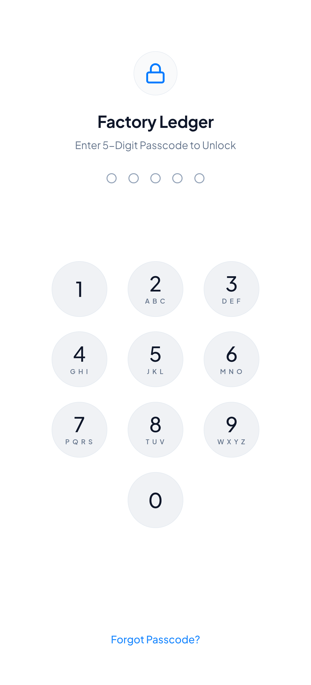
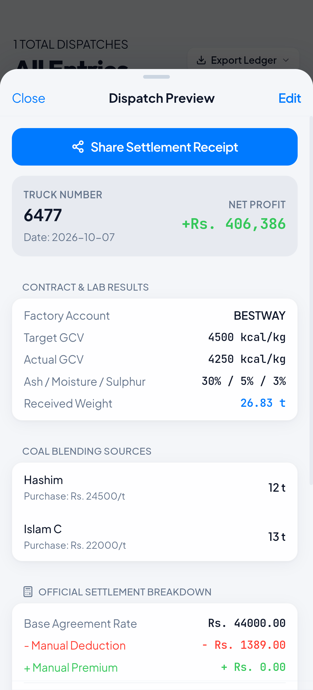
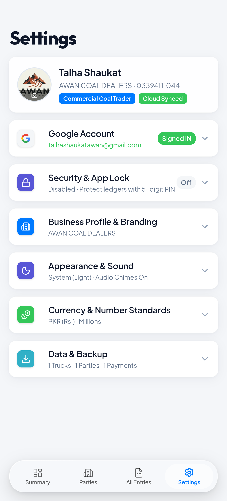

# Factory Ledger

<div align="center">

[](https://github.com/talhaawan-044/Factory-Ledger/actions/workflows/ci.yml)
[](LICENSE)


<p align="center">
  <b>A state-of-the-art commercial dispatch, quality blending, and party ledger accounting system.</b><br>
  Engineered specifically for coal trading, factory logistics, and industrial procurement.
</p>

<p align="center">
  <sub>Offline-First • Reliable Cloud Sync • Native Biometric Security • Apple iOS 18 HIG Interface</sub>
</p>

</div>

---

## Screenshots

<div align="center">
  <table>
    <tr>
      <td align="center" width="33%">
        <b>Security Lock Screen</b><br>
        <sub>5-digit PIN & Biometrics</sub><br><br>
        
      </td>
      <td align="center" width="33%">
        <b>New Dispatch & Profit</b><br>
        <sub>Live formulas & blending</sub><br><br>
        
      </td>
      <td align="center" width="33%">
        <b>Settings & Cloud Sync</b><br>
        <sub>Google Cloud Sync & Settings</sub><br><br>
        
      </td>
    </tr>
  </table>
</div>

---

## Overview

**Factory Ledger** bridges the gap between field-level logistics and financial accounting. Traditional bookkeeping apps fail when dealing with commodities like coal, minerals, and bulk materials that require complex quality deductions (caloric compliance, moisture adjustments), factory weighbridge readings, multi-source recipe blending, and live margin forecasts.

Factory Ledger provides an **all-in-one mobile and web management solution**: manage party balances, track dispatches, calculate truck profits in real-time, generate professional Excel workbooks and PDF receipts, and synchronize safely across devices with robust offline resilience.

---

## Core Features

### Smart Logistics & Dispatch Tracking
- **Live Profit Engine:** Calculates real-time projected profit per truck based on selling rate, purchase costs, transport deductions, and commission.
- **Coal Blending Recipe Matrix:** Blend multiple coal sources/grades per truck with individual tonnage and cost ratios.
- **Quality Deduction Engine:** Enter manual GCV (Gross Calorific Value) quality deductions or premiums per dispatch with visual caloric compliance gauges.
- **Weighbridge & Transit Loss:** Compare loaded coal recipe weight against factory weighbridge received weight with instant shortage loss/gain percentages.
- **In-Transit Pending Dispatches:** Record trucks departing the mine/yard prior to factory weighment; pending trucks are clearly tracked and excluded from profit totals until officially weighed.
- **Deal Estimator:** Simulate hypothetical multi-truck contracts and margin calculations before dispatching.

### Commercial Settlement & Taxation Mathematics
The application's commercial profit, deduction, and invoicing engines follow official industrial logistics and Pakistani corporate commodity standards:
- **Adjusted Rate:** $\text{Base Rate} - \text{Manual Deductions (GCV / Moisture)} + \text{Manual Premiums (GCV Bonus)}$.
- **Tax Withholding (Formula 18/5):**
  - $\text{Tax Base} = \text{Adjusted Rate} \times (1 + \text{Sales Tax } \% / 100)$.
  - $\text{Tax Deduction} = \text{Tax Base} \times (\text{Income Tax } \% / 100)$.
  - *(Standard defaults: 18% Sales Tax, 5% Income Tax Withholding, configurable in Settings).*
- **Payable Rate:** $\text{Adjusted Rate} - \text{Tax Deduction} - \text{Commission Per Ton}$. Broker commission is deducted directly from the settlement payable rate.
- **Billed Revenue:** $\text{Payable Rate} \times \text{Factory Received Weight}$.
- **Net Trading Spread (Profit):** $\text{Billed Revenue} - [\sum(\text{Coal Recipe Ton} \times \text{Buy Rate}) + \text{Freight} + \text{Loading} + \text{Crush} + \text{Royalty} + \text{Other Overheads}]$. *(In-transit trucks awaiting weighbridge scales are tracked separately and excluded from profit totals).*

### Commercial Party Ledger & Accounting
- **Single-Entry Running-Balance Ledger:** Accurate debit/credit ledger tracking invoices, received payments, paid refunds/advances, and running statement balances.
- **Receivables & Payables:** Instant visibility into net balances, outstanding invoices, and settled accounts.
- **Payment Vouchers & Receipts:** One-tap generated payment and dispatch vouchers with printable/shareable views.
- **Automatic Balancing:** Real-time balance recomputation upon editing or removing transactions.

### Privacy & Access Protection
- **iOS 18 Passcode Lock Screen:** 5-digit PIN lock screen with Apple HIG tactile keypad layout.
- **Slow PBKDF2 Hashing:** PINs are hashed using WebCrypto PBKDF2 (100,000 iterations) with a device-unique cryptographic salt stored strictly on the local device.
- **Escalating Lockout Rate Limiting:** 30-second lockout after 5 consecutive incorrect passcode attempts to prevent brute-forcing.
- **Hardware Biometrics:** Native Android fingerprint and biometric prompt via custom native plugin (`AppBiometricPlugin.java`).
- **Master Offline Recovery Key (`FL-XXXX-XXXX`):** Self-service offline recovery key allowing passcode resets without needing server connectivity.
- **Sensitive Gate Protection:** Passcode verification required to change security settings, export ledger data, or import backups.

### Cloud Sync & Offline-First Resilience
- **Offline-First by Design:** Operates fully without an internet connection or cloud account. All records are stored locally in IndexedDB via Dexie.
- **Reliable Cloud Sync:** Changes are pushed automatically to Firestore subcollections shortly after saving locally. Remote updates are pulled when you sign in, when the app starts, or when you tap *Refresh from cloud*. No persistent websocket listeners or background battery drain.
- **Firebase Firestore Subcollections:** Scalable cloud architecture synchronizing party records, dispatches, and payments as subcollections under the user's secure account ID.
- **Delta Sync & Soft Deletes:** Changes are tracked with `dirty` flags for efficient delta synchronization; deleted items are tombstoned via `deleted: true` to prevent cross-device resurrection.
- **Google Single Sign-On (SSO):** Seamless one-tap authentication via Capacitor Firebase Auth.

### Professional Exporting & Invoicing
- **Multi-Sheet Excel Reports:** Formatted `.xlsx` workbooks with color-coded profit badges, summary metrics, and ledger breakdowns generated on demand via `exceljs`.
- **PDF Slips & Statements:** Clean, customer-ready printable receipts and landscape audit reports generated via `jspdf` and `jspdf-autotable`.
- **WhatsApp Formatted Summaries:** One-tap formatted text statements for rapid WhatsApp sharing with drivers and factory accountants.
- **Full JSON Backups & Snapshots:** Complete data export for off-site archiving, with automatic pre-restore snapshots and one-click rollback.

### Apple iOS 18 Design Experience
- **Adaptive Light & Dark Themes:** Fully responsive interface designed to transition seamlessly between OLED dark mode and crisp iOS light mode.
- **Color Accent Themes:** Personalize your interface with presets like *Electric Sapphire*, *Emerald Green*, *Royal Violet*, and *Sunset Amber*.
- **Haptics & Audio Chimes:** Tactile button feedbacks, cash chime audio cues, and modal pop sounds.
- **Automatic Currency Formatting:** Localized comma notation and PKR formatting.

---

## Technology Stack

| Layer | Technologies |
| :--- | :--- |
| **Frontend Framework** | [React 19](https://react.dev/), [TypeScript](https://www.typescriptlang.org/), [Vite 8](https://vitejs.dev/) |
| **Styling & Design System** | [Tailwind CSS v4](https://tailwindcss.com/), Apple iOS 18 HIG Tokens & Solid Physical Palette |
| **Mobile Runtime** | [Capacitor 8](https://capacitorjs.com/) (Android) |
| **Local Database** | [Dexie.js](https://dexie.com/) (IndexedDB Engine) |
| **Cloud Backend** | [Firebase Firestore](https://firebase.google.com/docs/firestore), [Firebase Authentication](https://firebase.google.com/docs/auth) |
| **Reporting & Exporting** | `exceljs`, `jspdf`, `jspdf-autotable`, `html2canvas` (Code-split on demand) |
| **Icons & Typography** | [Lucide React](https://lucide.dev/), Plus Jakarta Sans, Outfit, JetBrains Mono |

---

## Directory Structure

```text
├── android/                        # Android Native Project (Capacitor)
│   ├── app/
│   │   ├── build.gradle            # App-level build & signing configuration
│   │   └── src/main/java/.../      # MainActivity & native AppBiometricPlugin
│   ├── keystore.properties         # Local release keystore properties (gitignored)
│   └── release.keystore            # Local production signing key (gitignored)
├── src/
│   ├── components/                 # Reusable UI & iOS modals
│   │   ├── IOSAppLockScreen.tsx    # 5-digit PIN & biometric lock screen
│   │   ├── IOSRecoveryKeyModal.tsx # Master offline recovery dialog
│   │   ├── DealEstimatorModal.tsx  # Profit & recipe forecasting tool
│   │   ├── DispatchReceipt.tsx     # Dispatch slip view
│   │   ├── PaymentReceipt.tsx      # Payment voucher view
│   │   └── Layout.tsx              # Root app shell, navigation & audio system
│   ├── pages/                      # Application route screens
│   │   ├── Summary.tsx             # Financial overview & KPIs
│   │   ├── PartiesList.tsx         # Commercial accounts directory
│   │   ├── PartyLedger.tsx         # Individual party transaction history
│   │   ├── DispatchForm.tsx        # Dispatch entry & coal blending builder
│   │   ├── AllEntries.tsx          # Filterable global ledger entries
│   │   └── Settings.tsx            # Cloud sync, security & theme options
│   ├── lib/                        # Infrastructure
│   │   ├── db.ts                   # Local IndexedDB database & sync bridges
│   │   ├── firebase.ts             # Firebase client configuration
│   │   └── syncManager.ts          # Firestore background synchronization
│   ├── utils/                      # Business logic & utilities
│   │   ├── calculations.ts         # GCV, moisture & profit algorithms
│   │   ├── securityLock.ts         # PIN hashing, offline key & biometric hooks
│   │   ├── exportSharing.ts        # Excel, PDF & WhatsApp generation
│   │   └── currency.ts             # Currency formatting & comma parsers
│   ├── types.ts                    # Strict TypeScript domain interfaces
│   └── index.css                   # iOS 18 Design tokens, dark mode & animations
```

---

## Getting Started

### Prerequisites
- **Node.js:** v18.0.0 or higher
- **npm:** v9.0.0 or higher
- **Android SDK:** Platform tools & Build tools (Compile SDK 34, Target SDK 34)
- **Java Development Kit:** OpenJDK 21 (configured for Gradle 8.14 & Android build toolchain)

### 1. Clone & Install Dependencies
```bash
git clone https://github.com/talhaawan-044/Factory-Ledger.git
cd Factory-Ledger
npm install
```

### 2. Environment Configuration (Optional Cloud Sync)

Factory Ledger supports two operational modes out of the box:

- **Offline-Only Mode (Default):**
  If no `.env` file is present, the app starts immediately in standalone offline mode. All records, dispatches, and settings are saved securely on your device inside IndexedDB. No external setup or internet access is required.

- **Cloud Sync Mode (Multi-Device):**
  To enable Google Sign-In and cloud synchronization:
  1. Create a project in [Firebase Console](https://console.firebase.google.com/).
  2. Enable **Authentication** (Google provider) and **Cloud Firestore**.
  3. Deploy security rules (`firebase deploy --only firestore:rules`).
  4. Copy `.env.example` to `.env`:
     ```bash
     cp .env.example .env
     ```
  5. Fill in your Firebase web app configuration in `.env`:
     ```env
     VITE_FIREBASE_API_KEY=your_api_key
     VITE_FIREBASE_AUTH_DOMAIN=your_project.firebaseapp.com
     VITE_FIREBASE_PROJECT_ID=your_project_id
     VITE_FIREBASE_STORAGE_BUCKET=your_project.firebasestorage.app
     VITE_FIREBASE_MESSAGING_SENDER_ID=your_sender_id
     VITE_FIREBASE_APP_ID=your_app_id
     ```

#### Android Google Sign-In (Code 10 Configuration)
For Google Sign-In to function on Android devices:
1. In Firebase Console, add an Android App with package name `com.factoryledger.app`.
2. Add your machine's debug and release SHA-1 / SHA-256 fingerprints to your Firebase Android app settings. (To view your SHA-1: `./android/gradlew -p android signingReport`).
3. Download `google-services.json` and place it in `android/app/google-services.json`.

---

### 3. Start Development Server
```bash
npm run dev
```
Open your browser at `http://localhost:5173`.

### 4. Build Web Bundle
```bash
npm run build
```

### 5. Build & Sync Native Android
```bash
npx cap sync android
```

### 6. Run on Connected Android Device
```bash
npx cap run android
```

---

## Building a Signed Production APK

The project is preconfigured to generate release builds using Gradle and Android SDK `apksigner`.

1. Ensure `android/keystore.properties` is present (excluded from version control):
   ```properties
   storePassword=YOUR_KEYSTORE_PASSWORD
   keyPassword=YOUR_KEYSTORE_PASSWORD
   keyAlias=factoryledger
   storeFile=release.keystore
   ```

2. Run the release build pipeline:
   ```bash
   npm run build && npx cap sync android && cd android && ./gradlew assembleRelease
   ```

3. Your optimized and aligned production APK is generated at:
   ```text
   android/app/build/outputs/apk/release/app-release.apk
   ```

---

## Security & Privacy Architecture

- **No Remote Telemetry:** The app collects zero user tracking or diagnostic metrics.
- **Passcode Convenience Lock:** A 5-digit PIN screen provides casual privacy against unauthorized device handlers, not database-at-rest encryption. Passcodes are hashed using WebCrypto PBKDF2 (100,000 iterations) with a device-unique cryptographic salt stored strictly on the local device. PIN credentials and recovery keys are never synchronized to Firestore.
- **Lockout Rate Limiting:** 5 consecutive failed passcode attempts trigger an escalating lockout timer (starting at 30 seconds) to slow down guessing attacks.
- **Biometric Hardware Isolation:** Biometric unlock uses Android's `BiometricPrompt` via custom native plugin; the app never sees fingerprint or face data.
- **Native OS Protection:** Android release builds specify `android:allowBackup="false"` and `FLAG_SECURE` to block unintended data leakage via `adb backup` or recent apps thumbnails. (In debug builds, `FLAG_SECURE` is disabled to facilitate automated testing and QA).
- **Dependency Audit & Accepted Risks:** A repository audit with `npm audit` notes transitive sub-dependencies in `@grpc/grpc-js` (via `@firebase/firestore` / `@capacitor-firebase/authentication`) and `uuid` <11.1.1 (via `exceljs` and `xcode` / `@capacitor/cli`). Running destructive `--force` updates would downgrade core frameworks. These upstream dependencies are tracked via Dependabot and noted as accepted risks while awaiting upstream patch releases. Direct project dependencies are fully verified.

---

## Architecture & Known Limitations

- **Accounting Model:** Single-entry running-balance commercial ledger (billed invoice amounts minus payments received / refunded), not double-entry general ledger.
- **Quality Deductions:** GCV and quality deductions/premiums are entered per dispatch with caloric compliance visualization; there is no automated sliding-scale penalty matrix.
- **Weighbridge Readings:** The factory weighbridge received weight is recorded directly; there is no gross/tare hardware weighbridge scale integration.
- **In-Transit Dispatches:** Dispatches saved prior to factory weighment are marked as in-transit and automatically excluded from aggregate net profit and billed revenue totals until officially weighed.
- **Storage Capacity:** Financial records and audit logs are stored locally on the device in IndexedDB via Dexie. Settings and fast-lookup flags stay in `localStorage`.
- **Cloud Sync & Conflict Resolution:** Changes are pushed automatically shortly after you save locally. Changes made on another device are pulled when you sign in, when the app starts, and when you tap *Refresh from cloud*. There is no live WebSocket push between devices. Conflicts are resolved per record by last edit time (`updatedAt`) using each device's clock (newest edit wins). Keep automatic date and time network synchronization enabled on every phone to avoid timestamp drift.
- **Settings Multi-Device Scope:** Shared business settings (business name, phone, tax rates) are synchronized across devices when modified. Device-specific preferences (theme, biometric credentials, PIN hashes) remain strictly isolated to the local device.
- **Security Scope:** The PIN screen provides casual privacy for shared device environments, not cryptographic database-at-rest encryption.
- **Cloud Setup:** Requires your own Firebase project (see Setup). Without one, the app runs in full offline-only mode.

---

## License

This project is licensed under the [MIT License](LICENSE).
Distributed as an industrial management solution for factories, dealers, and logistics operators.
